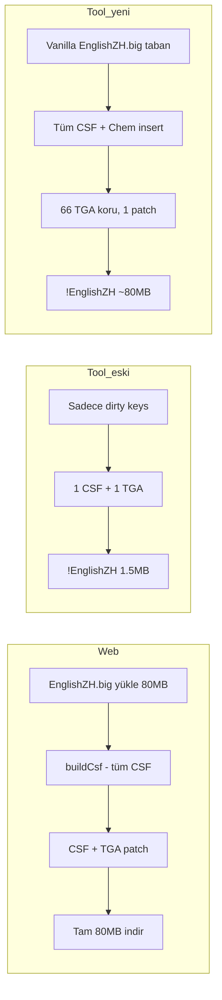

# GLA Toxin Tünel — Web vs CommandCardTool BIG Karşılaştırması

**Tarih:** 2026-06-22  
**Slot:** `controlbar:chem_constructglatunnelnetwork` (Toxin Worker → Tunnel Network)  
**Karşılaştırılan dosyalar:**

| Kaynak | Yol |
|--------|-----|
| Web indirme | `c:\Users\MSI\Downloads\EnglishZH (1).big` |
| CommandCardTool çıktısı | `d:\SteamLibrary\steamapps\common\Command & Conquer Generals - Zero Hour\!EnglishZH.big` |
| Vanilla | `d:\SteamLibrary\steamapps\common\Command & Conquer Generals - Zero Hour\EnglishZH.big` |

---

## 1. Özet tablo

| | Web `EnglishZH (1).big` | Tool `!EnglishZH.big` | Vanilla `EnglishZH.big` |
|---|---|---|---|
| **Boyut** | ~80,5 MB | ~1,5 MB *(eski build)* | ~80,5 MB |
| **CSF etiket sayısı** | 4.176 | 4.178 | 4.176 |
| **TGA girişi** | 66 | 1 | 66 |
| **`Chem_ConstructGLATunnelNetwork`** | **YOK** | `Toxin &TEtwork` | **YOK** |
| **`Chem_ToolTipGLABuildTunnelNetwork`** | **YOK** | `…Network (&T)` *(hatalı)* | **YOK** |
| **`ConstructGLATunnelNetwork`** | `Tunnel &Network` | `Tunnel &Network` (değişmemiş) | `Tunnel &Network` |

> **Not:** Web indirmesinde `Toxin`, `Retwork` veya `Chem_Construct*` geçen hiçbir CSF anahtarı bulunamadı. Dosya pratikte vanilla `EnglishZH.big` ile aynı CSF içeriğine sahip.

---

## 2. Oyun ne bekliyor?

Zero Hour **Toxin General (Dr. Thrax)** Worker kartındaki tünel düğmesi `CommandButton.ini` içinde **Chem** varyantı kullanır:

- **TextLabel:** `CONTROLBAR:Chem_ConstructGLATunnelNetwork`
- **ToolTipTextLabel:** `CONTROLBAR:Chem_ToolTipGLABuildTunnelNetwork`
- **ButtonImage:** `SUToxicTunnel` → `SUUserInterface512_004.tga`

Vanilla `EnglishZH.big` CSF'inde bu iki **Chem_** anahtarı **yoktur**. Oyun bu anahtarları bulamazsa:

- Buton metni: `MISSING: 'CONTROLBAR:Chem_ConstructGLATunnelNetwork'`
- Tooltip: `MISSING: 'CONTROLBAR:Chem_ToolTipGLABuildTunnelNetwork'`
- Tuş (A, T, …) **çalışmaz** — CSF'deki `&` hotkey bağlantısı kurulamaz.

Normal GLA Worker (`ConstructGLATunnelNetwork` = `Tunnel &Network`) farklı bir düğmedir; Toxin Worker onu kullanmaz.

---

## 3. Web sitesi nasıl kaydeder?

Web (`CsfModModal.tsx` → `saveCsfIntoExistingBig`):

1. Bellekteki **tüm** `EnglishZH.big` arşivini alır (~80 MB, 66 TGA + CSF).
2. `buildCsf(csfData)` ile **tam CSF** üretir (sadece değişen satırlar değil).
3. CSF girişini değiştirir; TGA'ya `updateHotkeyInBig` ile harf basar.
4. İndirilen dosya **aynı boyutta tam arşiv** kalır.

Toxin slot CSF id'si `controlbar:chem_constructglatunnelnetwork` — vanilla CSF'te bu id **yok**. Web'de slota tıklayınca çoğu zaman *"label not found"* görünür; kullanıcı CSF sekmesinden elle eklemeli veya toplu uygulama listesinde zaten var olmalı.

---

## 4. CommandCardTool (eski build) ne yapıyordu?

| Sorun | Etki |
|-------|------|
| **Kısmi BIG** — sadece CSF + 1 TGA yazılıyordu (~1,5 MB) | Web ile farklı çıktı formatı; oyun yine de `!EnglishZH.big`'i önce yükler |
| **CSF tabanı `!EnglishZH.big`** — vanilla yerine eski override okunuyordu | Hatalı/eksik CSF birikimi |
| **Yeni Chem anahtarları insert edilmiyordu** (whitelist bug) | `MISSING:` ekranı |
| **Tooltip'e `(&T)` eklendi** | Vanilla tooltip'te `&` yok; sondaki `(&X)` oyun tooltip'ini bozar |
| **Build etiketi `Toxin &TEtwork`** | T tuşu için `&` doğru harfe konmuş (T); görünüm garip ama hotkey harfi T ise mantıklı |

Tool TGA'yı doğru atlas'a yazıyordu:

```
!EnglishZH.big içeriği (eski):
  Data\English\generals.csf
  Data\English\Art\Textures\SUUserInterface512_004.tga   ← SUToxicTunnel
```

---

## 5. Kök nedenler (öncelik sırasıyla)

### A. Chem CSF anahtarları BIG'e gitmiyordu / yanlış formatta
Oyun **mutlaka** `Chem_ConstructGLATunnelNetwork` ve `Chem_ToolTipGLABuildTunnelNetwork` ister. Eski tool bunları ya hiç yazmıyordu ya da tooltip'i bozuk formatta yazıyordu.

### B. Tooltip formatı
Vanilla:
```
Base defense and underground tunnel. Units can enter the Tunnel Network...
```
Tool'un yazdığı (hatalı):
```
...exit at any other Tunnel Network (&T)
```
Oyun tooltip CSF'inde sondaki `(&X)` beklenmez → tooltip görünmez veya bozuk.

### C. Build etiketi formatı
Oyun **gömülü `&`** ister: `Toxin &Network`, `Toxin &Retwork`  
**Kabul etmez:** `Toxin Network (&T)`  

Doğru örnekler (T tuşu):
- `Toxin &Tetwork` — `&` sonraki harf hotkey

### D. Web indirmesi ile kullanıcı beklentisi uyuşmuyor
`EnglishZH (1).big` içinde `Toxin &Retwork` **yok**. Web'den indirilen dosya ya kaydedilmemiş, ya farklı bir indirme, ya da sadece TGA harfi değişmiş (CSF metni vanilla kalmış).

### E. «Apply all keys to images» yalnızca TGA sanıyordu (düzeltildi)
Bu buton **görsel boyama** içindir ama aynı zamanda CSF de kaydedilmeli. Eski build'de UI'da görünen `Toxin &Network` metni **Chem_ConstructGLATunnelNetwork** anahtarına yazılmıyordu → oyunda `MISSING`. Yeni build `EnrichVariantLabelsForSave` ile Chem + tooltip anahtarlarını BIG'e ekler.

### F. `game_path.txt` eksik
EXE `dist\` klasöründen çalışınca `!EnglishZH.big` **Steam yerine dist'e** yazılıyordu. Oyun Steam'deki dosyayı okur → MISSING devam eder.

```
d:\SteamLibrary\steamapps\common\Command & Conquer Generals - Zero Hour
```

---

## 6. Yapılan düzeltmeler (2026-06-22)

| Dosya | Değişiklik |
|-------|------------|
| `BigCsfWriter.cs` | Kaynak = **vanilla `EnglishZH.big`**; tüm 66 TGA + CSF kopyalanır, sadece CSF ve boyanan TGA patch'lenir (web ile aynı strateji) |
| `BigCsfWriter.cs` | Yeni Chem anahtarları CSF'e insert (override kaynakta yoksa) |
| `OptionsPage.xaml.cs` | `GetEffectiveCsfLabelsForSave()` — tam birleşik CSF sözlüğü |
| `OptionsPage.xaml.cs` | `SeedVariantTooltipCsf` — tooltip = vanilla metin (**`(&X)` eklenmez**) |
| `CommandCardHotkeyService.cs` | `GraftVariantLabelFromVanilla` — `Toxin &Network` formatı |
| `CsfVariantKeys.cs` | PascalCase `Chem_ConstructGLATunnelNetwork` anahtar eşlemesi |

---

## 7. Doğru kayıt sonrası beklenen `!EnglishZH.big`

| Alan | Değer |
|------|-------|
| Boyut | ~80,5 MB (vanilla ile aynı mertebe) |
| TGA | 66 (sadece `SUUserInterface512_004.tga` boyanmış) |
| `CONTROLBAR:Chem_ConstructGLATunnelNetwork` | `Toxin &Tetwork` *(T tuşu)* veya `Toxin &Retwork` *(R tuşu)* |
| `CONTROLBAR:Chem_ToolTipGLABuildTunnelNetwork` | Vanilla tooltip metni, **& veya (&X) olmadan** |
| `CONTROLBAR:ConstructGLATunnelNetwork` | `Tunnel &Network` (vanilla, değişmeden) |

---

## 8. Test adımları

1. `dist\CommandCardTool.exe` yanına `game_path.txt` → Steam ZH klasörü.
2. Eski `!EnglishZH.big` yedekle veya sil.
3. GLA Toxin → Worker → Tunnel Network → etiket + tuş uygula → **Apply to BIG**.
4. Oyunda Toxin Worker seç → tünel düğmesi:
   - Metin: `Toxin …` (MISSING yok)
   - Tooltip: uzun açıklama metni
   - Tuş: CSF'deki `&` harfi (ör. T)

Karşılaştırma aracı: `tools\CompareBigCsf\` → `dotnet run`

---

## 9. Web vs Tool — akış diyagramı



---

## 10. Referanslar

- Web doküman: `b_xVYnaSynIKZ-1773220180149/docs/KOMUT_KARTI_KISAYOL_DEGISTIRME.md`
- Slot haritası: `chem_constructglatunnelnetwork` → `SUToxicTunnel`
- CSF PascalCase: `CsfVariantKeys.CommandBarPascalBare`
